# Do we need compiler support for replication and partitioning for multi-socket CPU ray tracing?

*CS 348K Final Project Report*
Team members: **Sai Gautham Ravipati**, sgautham@stanford.edu

---

## 1. Background and Setup

### 1.1 The Problem

A multi-socket server CPU, from a memory standpoint, is a machine with a small distributed memory: each socket owns its own DRAM and pays an access cost (latency and bandwidth) when it accesses the DRAM of a different socket. Prior distributed ray/path-tracing systems provide techniques for placing the acceleration structure (such as a Bounded Volume Hierarchy — BVH) to incorporate the distributed setup. Systems such as **R2E2** (treelet replication by load) and **Wald et al.-style ray-queue cycling** address this by either replicating the scene's acceleration structure on each node, or by partitioning the scene across nodes and forwarding rays to whichever node owns the data.

Current compilation systems such as **Bonsai** turn a high-level recursive geometric query plus a description of the BVH and its layout into fused traversal code that runs on multi-threaded CPUs and GPUs.

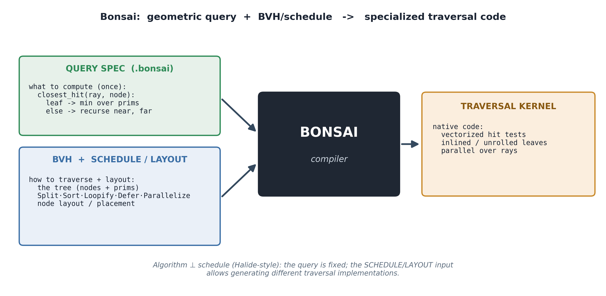

Its scheduling language has primitives like `Split`, `Sort`, `Loopify`, `Defer`, `Parallelize` and node-layout choices, but it does not have a notion of partitioning or replicating BVH data across memory nodes. The code emitted by Bonsai assumes a unified memory in which the BVH is stored across the DRAMs of different sockets. On a multi-socket machine this means that traversals into a BVH node can cross sockets to access a remote DRAM.

Even before designing a language extension around the Bonsai compiler to generate distributed placement of BVH structures, in this project we investigate the effects of different BVH placements, scoped to single-node, multi-socket CPUs (i.e., the "small distributed memory" case, not network-distributed). We try to answer whether a simple interleaved placement of the BVH is optimal under most circumstances, and under what scenarios this assumption breaks.

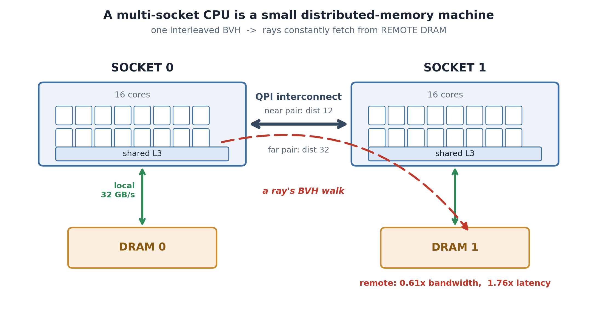

The following are the input/output description of our system:
**Inputs.** A path-tracing implementation (closest-hit traversal), a BVH built over the scene, a target machine with two or more NUMA nodes, and a placement strategy that controls how the BVH (and the rays) are laid out across nodes.
**Outputs.** A rendered frame from the path tracer, the strategy's render time, and structural statistics (per-socket footprint, BVH build time, etc.) needed to interpret the efficacy of a strategy.
**Constraints.** Equal compute across all strategies (both sockets, all available cores) and identical scene output across all strategies.

### 1.2 Falsifiable hypothesis

On realistic ray-tracing workloads on a multi-socket CPU, NUMA-aware placement (replication or partitioning) gives a non-negligible speedup over the current interleaved placement. If true across regimes, Bonsai should expose this primitive. If false, the language change isn't worth the complexity for distribution at this level of the hierarchy.

### 1.3 Summary of the technical problem

Using a performance simulator can be slow; hence, to try different placement strategies, it is important to isolate the effects of these strategies on application performance:

- **Cache-vs-DRAM confound.** Partitioning automatically halves the per-socket working set. A naive partition "winning" could just be because of cache. The pipeline measures BVH bytes per socket and labels every data point as `cacheRes / DRAMbnd` based on the per-socket L3 capacity and DRAM capacities.
- **Controlled NUMA distance.** A 4-socket Broadwell node (Sherlock `bigmem`) has SLIT distances `{10 local, 12 near, 32 far}`. We use `numactl --cpunodebind --membind` on a chosen socket pair to vary the inter-socket distance while keeping cores, clock, DRAM, scene, and threads identical. At times the node could be shared and it could be hard to isolate the effects of BVH placement; in such cases, the experiments were rerun to gain exclusive access to the node.
- **Baseline.** Bonsai's emitted LLVM code was having issues on the Sherlock machine (mainly multi-threading-related issues when porting from ARM to x86). We implement a C++ baseline that is similar to the LLVM code generated by Bonsai. Further, we verify the handwritten C++ is performant by measuring it against Bonsai-generated code, and making sure all the schedules for the RTIOW implementation of the path tracer exist in the C++ implementation.

---

## 2. Approach

### 2.1 What we started with

We started with a C++ path tracer modeled on the kind of traversal kernel Bonsai emits. All experimentation — the four placement modes, the NUMA-local spinlock queue (for ray-queue cycling), the procedural hairball generator, the experiment-sweep driver code, and the gates — is work we built for this project. The sphere generator is taken from the driver code of Bonsai's RTIOW implementation.

### 2.2 Placement strategies

The renderer implements four data-placement modes. All four share the same traversal code, the same scene, and the same thread budget; they differ only in what bytes live where:

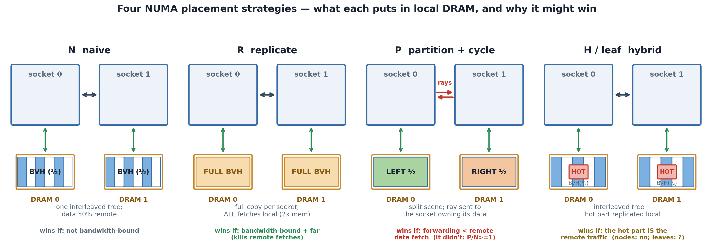

| | what's local on each socket | per-socket cost | wins when |
|---|---|---|---|
| **N** naive | BVH nodes interleaved across local and remote | `G / n_sockets` | not bandwidth-bound |
| **R** replicate | full BVH + geometry (`numa_alloc_onnode`, first-touched) | `G` | bandwidth-bound + far remote |
| **P** partition | half the triangles + BVH; rays cycled via local queue | `G / n_sockets` + queue | ray-forwarding cost < remote-fetch cost |
| **H** node-hybrid | full interleaved tree + top-K BFS-ordered nodes copied per-socket | `G / n_sockets + hot_K` (~12 KB at K=8) | the *hot reused* data is the remote traffic |

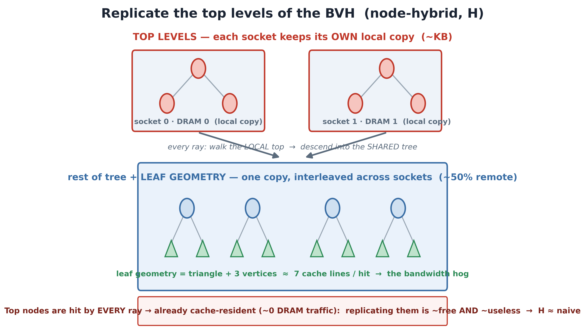

We also implemented a `leafhybrid` replication variant that replicates the hot leaf geometry per socket, but investigating the failure of this mechanism has been left to later work.

### 2.3 Workloads (the memory-bound contrast)

Two scenes chosen specifically to flip the memory-to-compute ratio:

- **Spheres** — analytic Ray-Tracing-in-One-Weekend grid (lambertian / metal / dielectric). Each hit costs ≈ 1 cache line (the sphere record). Primarily compute-bound.
- **Hairball** — a procedurally grown ball of tangled triangle tubes, generated by `gen_hairball(n_strands, segs, sides, seed)`: each strand starts on a small sphere, advances as a curled random walk (`segs` steps, Gaussian directional jitter), and is thickened into a tube ring of `sides` vertices that triangulates into `segs × sides × 2` triangles. Each leaf hit reads a triangle (16 B) plus its 3 vertices (24 B each — position + normal) ≈ 7 cache lines/hit. The strands physically overlap, so the BVH has overlapping leaves and high traversal cost. Primarily memory-bound.

| 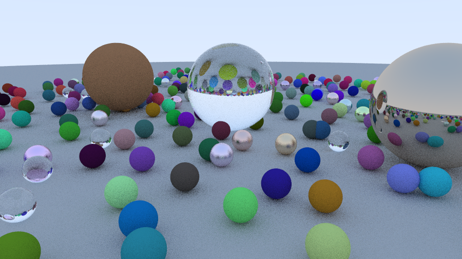 | 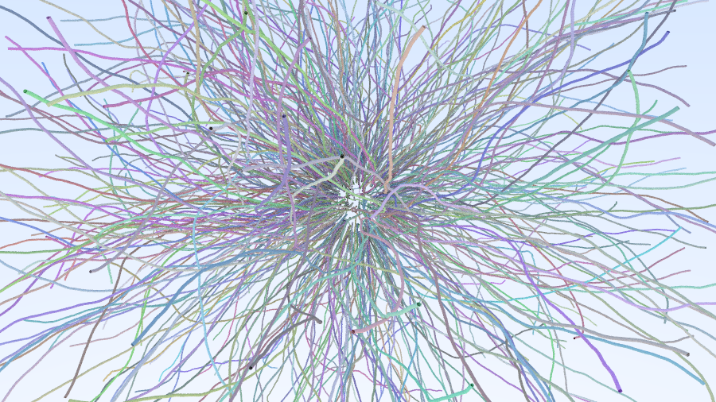 |
|:---:|:---:|
| **Spheres** — compute-bound, ~1 line/hit | **Hairball** — memory-bound, ~7 lines/hit |

Both scenes are parameterised so the working set sweeps from cache-resident (≈ 28 MB BVH) up to ≈ 786 MB BVH (for hairball, 6000 strands × 120 segs × 12 sides = 17.3 M triangles, close to the renderer's 2²⁸ primitive capacity).

### 2.4 Correctness machinery

A deterministic configuration (depth-1, compute-light, no scatter RNG, so thread order can't perturb the output) is run before every experiment; the resulting PPM is md5-compared across every mode and queue mechanism. We verify `naive == replicate == partition == hybrid` across scenes. The Monte-Carlo renders are not bit-identical — that can be because of sampling noise, not placement.

### 2.5 What we tried that did not work (and how it shaped the design)

- We first built the ray queue with a `std::mutex` + `condition_variable`, but the kernel-lock and wakeup overhead per cross-socket ray dominated partition's render time, swamping the NUMA signal we were trying to measure.
- We replaced it with a NUMA-local spinlock + spin-poll queue whose storage is first-touched on the consumer socket so dequeues stay local, and verified in a deterministic config that both implementations produce bit-identical images — so the new queue is strictly faster, not subtly broken.
- Asymmetric compute (1× vs 2× threads). Early checkpoints unfairly gave partition both sockets while naive used one. Fixed with **equal 2× threads** across all strategies; spawned-worker counts logged per cell so fairness is auditable.
- Texture-overlay bandwidth pressure. A pool of random texture lookups at each hit was meant to push the renderer toward bandwidth-bound, but lookups can be too rare. Hence this was replaced by simply scaling scene size (sweeping past L3).
- Top-K *node* replication (H), built on the intuition that the top of the tree is hot. The result was ≈ N — the top nodes are *cache-resident*, not bandwidth-hot. We therefore experimented with replicating the leaf nodes.
- Leaf-by-hotness *reorder*. Packed hot vertices into a contiguous prefix. This appears to scatter every triangle's three vertices across cache lines and kill the prefetcher; it ran ≈ **2× slower** than naive.
- Leaf-by-hotness *slot map*. Kept vertices in original strand order and added a shared `int32 vslot[]` indirection. The implementation does not yet give coherent results, and we leave the investigation to future work.

### 2.6 Compute / memory mapping

The renderer pins one worker thread per logical CPU in the bound cpuset, partitions the framebuffer into per-socket ray queues, and uses first-touch to bind the BVH (or its copies / hot prefix) and the queue's path storage to local DRAM. Workers are spread evenly across both sockets so both memory controllers stay active. The same scalar inner loop runs in every mode.

### 2.7 Experiments

The following experiments are run, each isolating one variable:

- **E1 — raw NUMA penalty (`numa_probe`).** Pointer-chase latency + STREAM-triad bandwidth, local vs cross-socket at distances 12 and 32. Establishes the budget any strategy is fighting for.
- **E2 — placement matrix × scene-size sweep.** All four modes × two scenes × distance {near, far} × five scene sizes × 3-rep median; equal threads, local queue, correctness-gated. Tests when (and which) placement helps.

---

## 3. Evaluation and Results

### 3.1 Definition of success

Success here is **not** a speedup number. It is a build-or-don't-build recommendation per workload regime, with the confounds ruled out, against the baseline implementation. The experiments either support or falsify the hypothesis in §1.2.

### 3.2 Experimental setup

- **Machine.** Stanford Sherlock `bigmem` partition, sh02-12-class node — 4-socket Broadwell, 128 logical CPUs, SLIT `{10, 12, 32}`. `--cpus-per-task=64`, `--mem=256G`, no `--exclusive` (bigmem disallows it).
- **NUMA control.** `numactl --cpunodebind=0,N --membind=0,N` selects the socket pair; the near pair is `{0,1}` (dist 12), the far pair is `{0,2}` (dist 32).
- **Baseline.** C++ path tracer with simple interleaving across DRAM nodes.
- **Metric.** `render_ms` — the steady-state render loop only, median of 3 reps. Build time is logged separately (§3.5).
- **Scene sweep.** Spheres `grid_half ∈ {100, 300, 500, 800, 1200}`. Hairball `strands ∈ {200, 800, 1600, 3000, 6000}`. Per-socket BVH spans 28 MB → 786 MB for hairball; L3 ≈ 40 MB.

### 3.3 E1 — the budget every strategy must recover

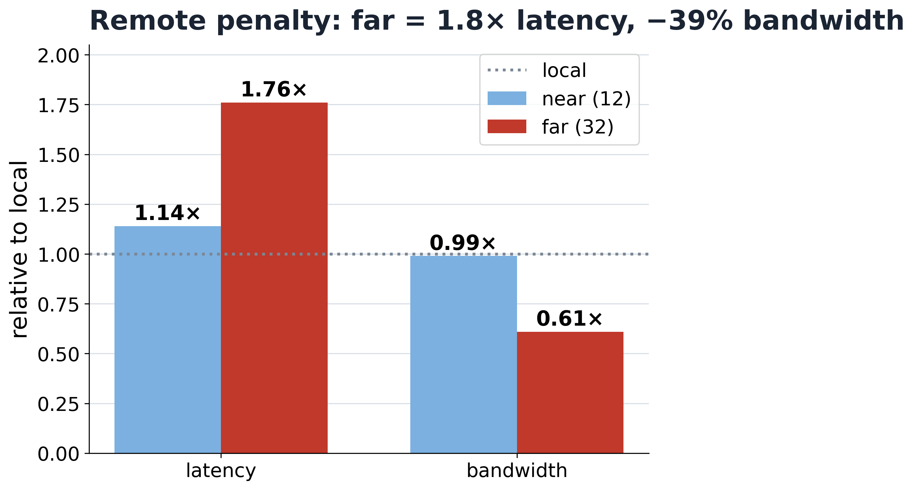

| dist | latency vs local | bandwidth vs local |
|-----:|:----------------:|:------------------:|
| 12 (near) | **1.14×** | **0.99×** |
| 32 (far)  | **1.76×** | **0.61×** |

The near distance is essentially a latency tax. The far distance is a **39 % bandwidth wall**. Any placement strategy can only deliver up to roughly this gap, and only when the workload is bandwidth-bound.

### 3.4 E2 — result matrix for hairball scene and plots for hairball/sphere

Median `render_ms` ratios vs naive on the memory-bound hairball; all strategies use the full machine:

```
            R/N                P/N                H/N
size   near    far       near    far        near    far
 800   0.81    0.83      0.90    1.01       0.86    0.96
1600   0.97    0.79      0.99    1.04       0.94    0.97
3000   0.93    0.76      1.15    1.16       0.99    0.98
6000   0.88    0.75      1.27    1.25       1.01    0.98
```

For the compute-bound spheres, most ratios (R/N, P/N, H/N) sit at ≈ 1.0 across every size and distance.

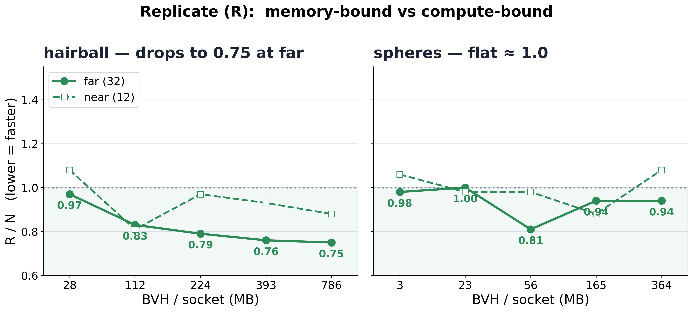

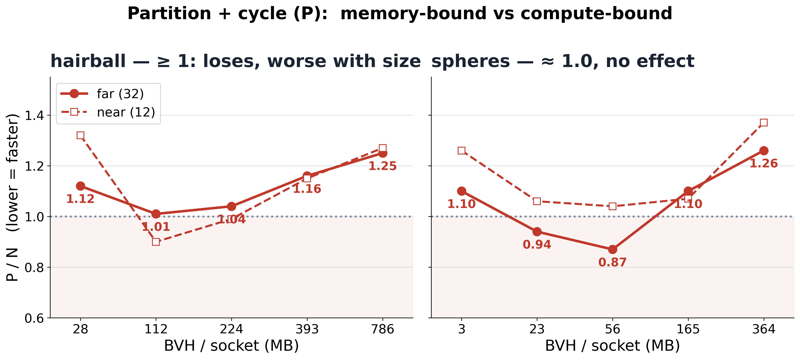

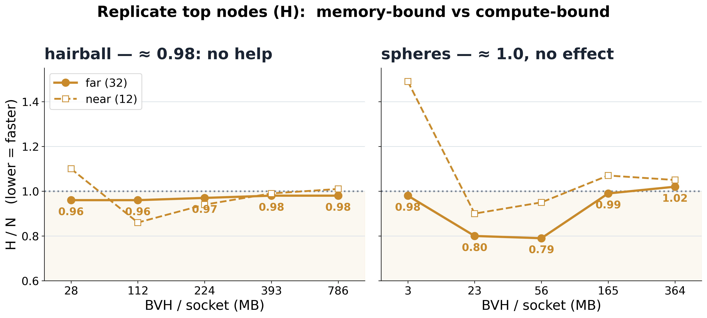

**Interpretation**

- **R wins, and the win grows with both size and distance.** At hairball-6000 far, replication is **25 % faster** than naive, and the ratio tracks the 39 % bandwidth penalty measured in E1. The cleanest single comparison is at approximately *matched per-socket footprint*: spheres at 364 MB (R/N = 0.94, single-cell noise) vs hairball at 393 MB (R/N = 0.76). The data on each socket is the same size; what differs is **how memory-intensive each hit is**. That falsifies the simpler "more memory ⇒ replication helps" story — what matters is **bandwidth-intensity per hit**.
- **P loses, and *worsens* with size.** Partition trades remote *data* fetches for cross-socket *ray* forwarding; the forwarding rate roughly doubles (2.0 → 4.0 rays/path) as the scene grows and more rays cross between sockets. On this tightly coupled node the forwarding cost dominates, and it grows with size while the locality saving per ray does not.
- **H ≈ N.** Replicating the top-8 BVH levels (~12 KB) costs near zero and saves near zero, because the top nodes are touched by *every* ray, so they live in L1/L2 and produce ≈ 0 DRAM traffic. The bandwidth bill is in the **leaves**, which H leaves interleaved. However, gains from replicating can be seen at the near distance, where the only remote cost is latency (1.14×), not bandwidth (0.99×), and the top-K BVH nodes are pure latency-bound pointer-chases that every ray performs, so making them local reduces the latency for small scenes. In these small scenes, upper-tree traversal is a non-trivial fraction of per-ray time, so eliminating those remote latency stalls actually moves the needle. As scene size grows, leaf-fetch bandwidth dominates total time and H can't touch leaves, so its small upper-tree win becomes a vanishing fraction, and H/N drifts back to ~1.0.

### 3.5 Caveat — build amortization

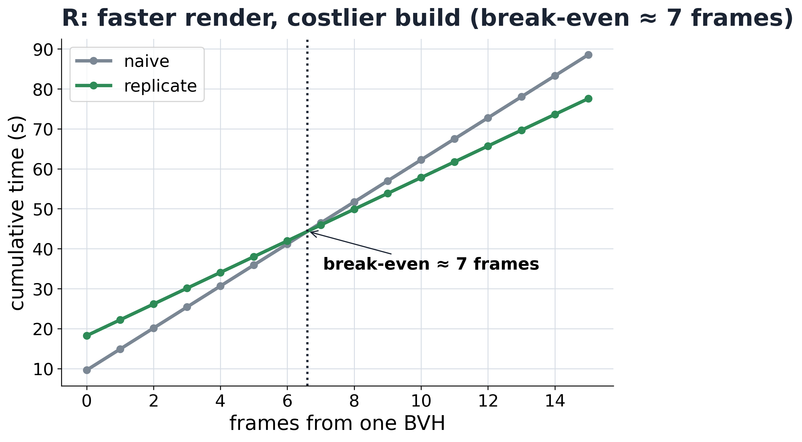

The R ratios are render-time. Replication builds the BVH **once per socket**, so its setup is ≈ 1.8× naive's. At hairball-6000 far:

```
                 setup (s)   render/frame (s)
 naive               9.6        5.26
 replicate          18.2        3.96
 break-even        ≈ 7 frames rendered from the same BVH
```

For animation, progressive sampling, or any pipeline that renders many frames from one tree, render_ms is the right metric and R wins overall. For a single one-shot still, build matters and naive wins. The deck reports render_ms and labels this caveat explicitly.

### 3.6 Hot-leaf replication

Since the bandwidth bill is in the leaves rather than the upper tree, the natural cheap variant of R is to replicate only the *hot* leaf geometry per socket. A profiling pass over primary rays attributes leaf-node visits to the vertices each leaf references, ranks the vertices by access count, and selects the top fraction; the renderer is extended with a `leafhybrid` mode that places only those hot vertices in per-socket local DRAM and leaves the rest interleaved. This has been left as later work, as the existing implementation was not giving coherent results.

### 3.7 What limited the win

- **R** is limited by the raw NUMA bandwidth gap (E1). At near, the gap is ~1 %, so R can't deliver; at far it's 39 %, and R captures most of it as the working set grows.
- **P** is limited by **ray-forwarding throughput** on the shared interconnect — measured by `fwd_rate`, which doubles from small to large scenes. The harder fundamental cost is the link itself. This can be more evident, and partitioning can win, if we are performing out-of-core / disk access or operating in a truly distributed setting in which we are making an out-of-socket access.
- **H** is limited by **access distribution**: it replicates exactly the bytes that were never DRAM-bound to begin with.

### 4. Summary

The hypothesis — that NUMA-aware placement gives a non-negligible speedup over interleave — is:

- **Supported** for **full BVH replication** on **memory-bound, L3-spilling** workloads at **NUMA distances large enough to show a real bandwidth gap** (up to **25 % at far** on hairball-6000, scaling with both size and distance).
- **Falsified** for **single-node, equal-thread partition + ray-cycle** (P/N ≥ 1.0; gets worse with size).
- **Falsified** for **top-K node-hybrid** (H ≈ N — replicates cache-resident data).
- **Irrelevant** for **compute-bound workloads** (no remote bandwidth to recover — all ratios ≈ 1.0 regardless of working-set size).

---

## 5. References

- Root, AJ et al. *Bonsai: a DSL for recursive geometric queries*. PLDI 2026.
- Fouladi, Sadjad, et al. *R2E2: Low-Latency Path Tracing of Terabyte-Scale Scenes using Thousands of Cloud CPUs* SIGGRAPH Asia 2023.
- Wald, Ingo, et al. *Data Parallel Multi-GPU Path Tracing using Ray Queue Cycling* Computer Graphics Forum 2023. 
- Pharr, Jakob, Humphreys. *Physically Based Rendering: From Theory to Implementation,* 4th ed. for BVH construction, Möller-Trumbore intersection, scene conventions.
- Shirley, Peter, et al. *Ray Tracing in One Weekend* for the analytic spheres scene.
