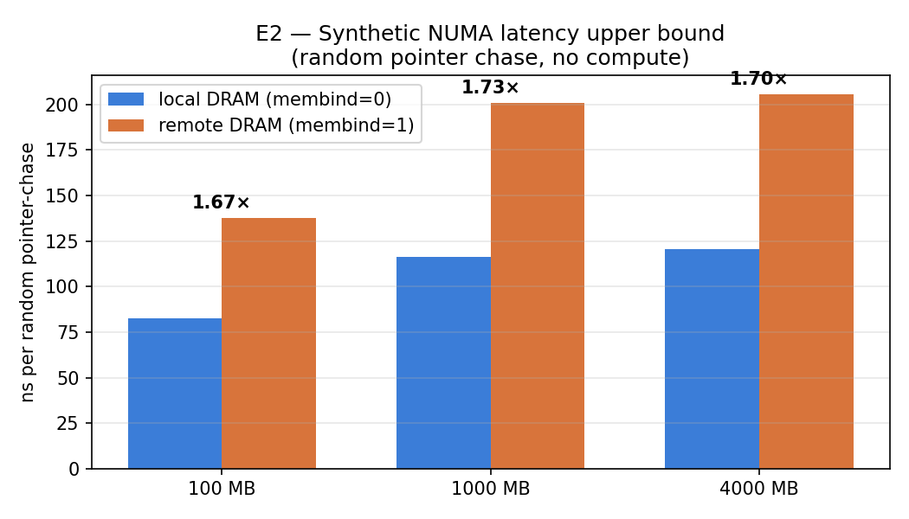
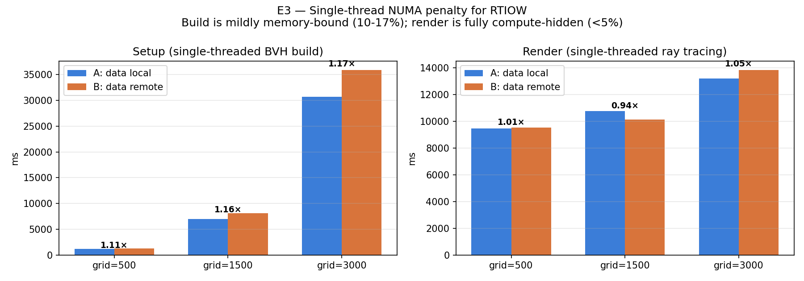
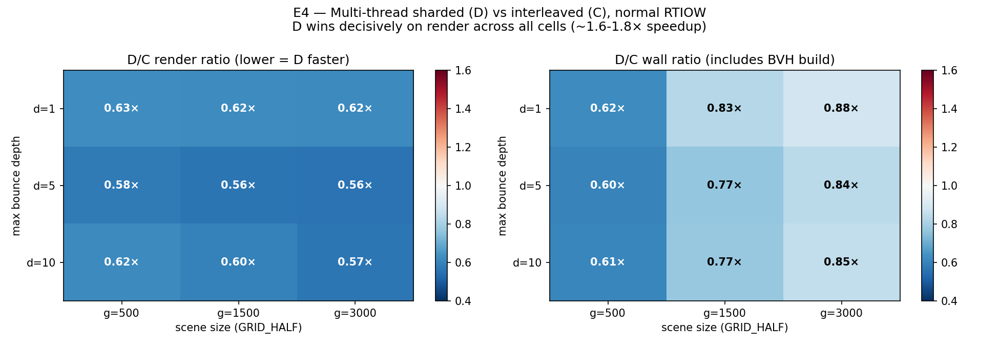
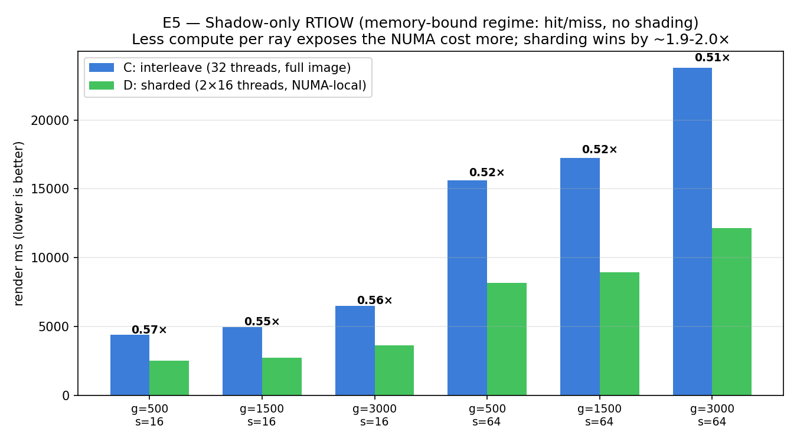

````markdown
# Checkpoint 2

This checkpoint moves from the Checkpoint 1 single-device L2↔L1 harness on the
Apple M4 Pro, where no clear memory-system pressure signal was observed, to
Sherlock's dual-socket NUMA setup. The main motivation is that the
socket-to-socket distance exposes a much stronger memory-latency gradient.

For this checkpoint, a standalone C++ reference renderer was built to match
Bonsai's memory layout (particularly to resolve issued with u32), 
a NUMA-aware sharded version was added, and five experiments were 
run to understand where sharding helps and where it does not.

---

## Repository layout

```text
checkpoint2/
├── README.md                          # this file
├── rtiow_native.cpp                   # standalone reference renderer
│                                      # matches Bonsai memory layout
│                                      # supports SHARD/TILE/SHADOW env knobs
├── pointer_chase.cpp                  # synthetic NUMA latency benchmark
├── checkpoint2_all.sh                 # one-shot driver for E1-E5
├── debug_D.sh                         # debug script for exp-D output image not being stored
├── plot_results.py                    # plot generation from CSVs
├── data/                              # raw measurement results
│   ├── e1_hardware.txt                # node topology and NUMA distances
│   ├── e2_pointer_chase.csv           # synthetic latency results
│   ├── e3_AB.csv                      # single-thread NUMA penalty
│   ├── e4_CD.csv                      # multi-thread C vs D
│   ├── e5_shadow.csv                  # shadow-only C vs D
│   └── images/                        # debug images
├── plots/
│   ├── e2_pointer_chase.png
│   ├── e3_AB_numa.png
│   ├── e4_CD_heatmap.png
│   ├── e5_shadow.png
````

---

## How to reproduce

On a 2-socket Sherlock node:

```bash
chmod +x checkpoint2_all.sh
./checkpoint2_all.sh                                  # ~10-20 min
python3 plot_results.py data                          # writes plots/*.png
./debug_D.sh                                          # verify D correctness
```

`checkpoint2_all.sh` embeds `rtiow_native.cpp` and `pointer_chase.cpp` as
heredocs, builds them with `g++ -fopenmp`, and runs experiments E1-E5
sequentially. The output is written to a timestamped directory and tarball.

---

## Backend

The runs were done on Sherlock node `sh02-12n02`, which is an Intel
Sapphire Rapids dual-socket machine:

```text
2 NUMA domains, 16 cores per socket (32 total), 256 GB DRAM per socket
NUMA distance matrix: 10 / 21    <- ~2.1x remote-vs-local
```

This node is useful for the experiment because the NUMA distance ratio is
large: 21:10, compared to the more common 12:10 ratio on some other Sherlock
nodes. This gives a stronger signal for testing whether NUMA-aware sharding
matters.

---

## Experiments

### E1 — Hardware characterization

`data/e1_hardware.txt` records `numactl --hardware`, `lscpu`, the NUMA-distance
matrix, and CPU flags for the runtime node. This is mainly methodology
documentation and also confirms that the node has at least two NUMA domains
available.

### E2 — Synthetic random-access pointer chase

`pointer_chase.cpp` builds a random-access index array at a fixed working-set
size and walks 200M pointer-chase hops with almost no compute. It is run under
`numactl --membind=0` for local memory and `numactl --membind=1` for remote
memory.



| Working set | Local ns/access | Remote ns/access | Ratio     |
| ----------- | --------------- | ---------------- | --------- |
| 100 MB      | 82.5            | 137.8            | **1.67x** |
| 1 GB        | 116.3           | 200.9            | **1.73x** |
| 4 GB        | 120.8           | 205.7            | **1.70x** |

**Takeaway:** the hardware has a NUMA latency ceiling of around **1.70x** when
there is almost no compute to hide memory latency.

### E3 — RTIOW single-thread A=local vs B=remote

This experiment tests whether the real ray-tracing workload exposes the NUMA
latency that E2 shows is available.

A is the single-thread renderer with data placed on socket 0.
B is the same renderer with data placed on socket 1.

Both are controlled using `numactl --membind`.



| Grid | A render | B render | Penalty | A setup | B setup | Setup penalty |
| ---- | -------- | -------- | ------- | ------- | ------- | ------------- |
| 500  | 9475 ms  | 9549 ms  | 0.8%    | 1179    | 1313    | 11%           |
| 1500 | 10759 ms | 10126 ms | noise   | 6988    | 8094    | 16%           |
| 3000 | 13199 ms | 13820 ms | 4.7%    | 30738   | 35850   | 17%           |

**Takeaway:** the single-thread renderer exposes only **≤5%** NUMA penalty.
This suggests that out-of-order execution and hardware prefetching hide most
of the remote-DRAM cost when each ray has enough computation to overlap with
memory accesses.

### E4 — Multi-thread C vs D on the normal scene

This is the main sharding experiment.

C is one process with 32 threads, using:

```bash
numactl --interleave=all
```

So pages are round-robin interleaved across both sockets.

D is two processes with 16 threads each. Each process is pinned to one socket
and gets its own local copy of the BVH and primitives. The two processes render
alternating image columns:

```bash
RTIOW_SHARD_BAND=1 RTIOW_SHARD_OF=2 RTIOW_SHARD_AXIS=1
```

Together, the two outputs form the full image.



Render-only D/C ratio:

| GRID \ DEPTH |     1 |     5 |    10 |
| -----------: | ----: | ----: | ----: |
|          500 | 0.63x | 0.58x | 0.62x |
|         1500 | 0.62x | 0.56x | 0.60x |
|         3000 | 0.62x | 0.56x | 0.57x |

**Takeaway:** render-only D is **1.6-1.8x faster** than C across
the sweep. This is close to the synthetic NUMA upper bound from E2.

The wall-time ratio is better for smaller scenes because D also benefits from
parallel BVH construction. For larger scenes, wall time becomes dominated by
the single-threaded BVH build, so the total wall-clock benefit becomes smaller
(for example, around 0.85x at GRID=3000).

### E5 — Shadow-only mode

This experiment removes most of the per-ray compute. A ray traverses the BVH,
returns black if it hits anything, and returns white if it misses. There is no
scatter and no recursion.

The goal is to push the workload closer to a memory-bound regime, where OoO
execution and prefetching cannot hide the memory cost as easily.



| GRID | SAMPLES | C render | D render | D/C       |
| ---- | ------- | -------- | -------- | --------- |
| 500  | 16      | 4410 ms  | 2505 ms  | 0.57x     |
| 500  | 64      | 15602 ms | 8162 ms  | **0.52x** |
| 1500 | 64      | 17235 ms | 8926 ms  | **0.52x** |
| 3000 | 64      | 23793 ms | 12145 ms | **0.51x** |

**Takeaway:** in shadow-only mode, D wins by around **1.9-2.0x**. This is even
higher than the synthetic NUMA latency ratio, likely because C also suffers
from memory-controller contention at 32 threads. Once the compute is reduced
down, the interleaved-memory version cannot hide the remaining latency and
contention with OoO and prefetched execution. 

---

## What sharding buys on this hardware

The sharded version helps for three main reasons:

1. **Local DRAM access on every load.**
   D avoids remote pages and cross-socket traffic. C, with interleaved memory,
   pays remote access on a significant fraction of loads. This benefit is
   bounded by the hardware NUMA ratio, which is around 1.7x on this node.

2. **Less memory-controller contention.**
   In C, 32 threads issue requests across the interleaved memory system. In D,
   each socket's memory controller mostly serves only the 16 threads on that
   socket, which reduces queuing.

3. **Parallel BVH construction.**
   C builds one BVH, single-threaded, over interleaved memory. D builds two
   copies concurrently, one per socket, each using local memory. This improves
   wall-clock time, especially for smaller scenes.

## When sharding is not worth it

Single-thread and low-thread regimes do not show much NUMA penalty. In E3, the
penalty is under 5%, which means the hardware is already hiding most of the
remote-memory cost. So sharding might not be beneficial. It adds memory replication 
and process-management overhead, so it only makes sense when the workload runs at
high enough thread count to expose memory-controller or bandwidth contention.

## Variance and reproducibility caveat

The numbers above are from an exclusively allocated `sh02-12n02` node.

A follow-up run on a shared `sh02-09n46` node, where another tenant had claimed
8 of the 32 cores, showed very different behavior: one shard ran 2.7x slower
than the other, and D lost to C overall.

Therefore, the speedups should be re-verified after the checkpoint deadline on
a clean exclusive node. The results above are for this checkpoint,
but should not yet be treated as the final project claim.

---

## Next tasks
This checkpoint only tests the replicated-sharded regime, where the scene fits
twice in available DRAM across the two NUMA domains. On this hardware, that
limits the approach to roughly 32 GB scenes. Beyond that, replication is not feasible. 
The next step is to move toward spatial scene distribution with ray-queue cycling, 
similar to R2E2 and Wald et al. HPG'23.

The next tasks are:

1. Re-verify sharding numbers. 
2. Run experiments from cp1 to validate if distribution is beneficial on sherlock. 
3. Implement a minimal spatial-partitioned version with ray queues.
4. Demonstrate that the queued version can still operate at scene sizes where
   replicated sharding cannot fit, for example around `GRID_HALF=10000+` or
   roughly 50 GB scenes.
5. Design an abstraction that can code-generate the handwritten versions.

```
```